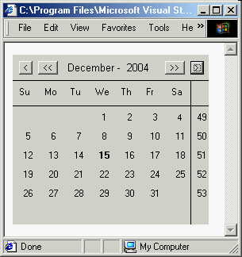



## Custom Calendar Control

### Description

We were trying to create an application in a COM enabled programming envoriment, and needed the weeks shown in a calendar. We came across a bug in ALL of Microsoft's calendars (including Outlook) that will list the wrong week number on certain years. E.G. December 2003/2004. We made a custom VB OCX that does the trick, even thou it's not as pretty as the Microsoft one.
 
### More Info
 
Properties :

MoCalendar1.TheDate  [current selected date]

Events :

ChangeMonth()

GotDate()

ClickDate()

             |
---                |---
**Submitted On**   |2001-07-03 16:24:46
**By**             |[QueTwo](https://github.com/Planet-Source-Code/PSCIndex/blob/master/ByAuthor/quetwo.md)
**Level**          |Intermediate
**User Rating**    |4.7 (14 globes from 3 users)
**Compatibility**  |VB 4\.0 \(32\-bit\), VB 5\.0, VB 6\.0
**Category**       |[Custom Controls/ Forms/  Menus](https://github.com/Planet-Source-Code/PSCIndex/blob/master/ByCategory/custom-controls-forms-menus__1-4.md)
**World**          |[Visual Basic](https://github.com/Planet-Source-Code/PSCIndex/blob/master/ByWorld/visual-basic.md)
**Archive File**   |[Custom Cal22160732001\.zip](https://github.com/Planet-Source-Code/quetwo-custom-calendar-control__1-24697/archive/master.zip)

